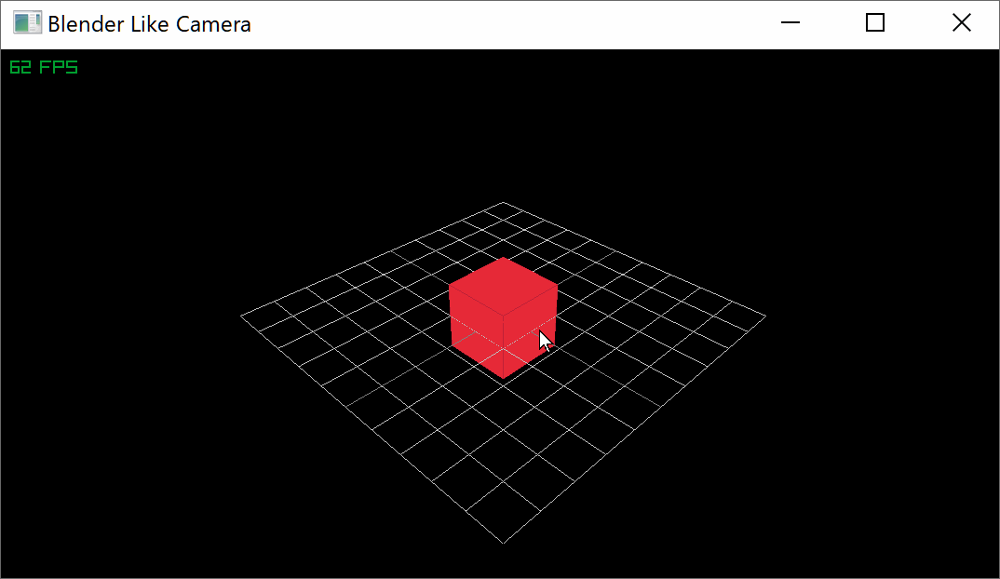

## blender like camera for raylib



## build
```

git submodule update --init
tools\premake5 vs2017

```

## usage

```


#include "raylib.h"
#include "blenderlikecamera.hpp"

int main(void)
{
	// Initialization
	//--------------------------------------------------------------------------------------
	const int screenWidth = 1920;
	const int screenHeight = 1080;

	SetConfigFlags(FLAG_WINDOW_RESIZABLE);
	SetConfigFlags(FLAG_VSYNC_HINT);
	InitWindow(screenWidth, screenHeight, "Blender Like Camera");

	// Define the camera to look into our 3d world
	Camera3D camera = { 0 };
	camera.position = Vector3 { 10.0f, 10.0f, 10.0f };  // Camera position
	camera.target = Vector3 { 0, 0, 0};      // Camera looking at point
	camera.up = Vector3 { 0.0f, 1.0f, 0.0f };          // Camera up vector (rotation towards target)
	camera.fovy = 45.0f;                                // Camera field-of-view Y
	camera.type = CAMERA_PERSPECTIVE;                   // Camera mode type
	SetCameraMode(camera, CAMERA_FREE);

	Vector3 cubePosition = { 0.0f, 0.0f, 0.0f };

	// SetTargetFPS(60);
	//--------------------------------------------------------------------------------------

	while (!WindowShouldClose())
	{
		blender_like_camera::UpdateCamera(&camera);

		// Draw
		//----------------------------------------------------------------------------------
		BeginDrawing();

		ClearBackground(BLACK);

		BeginMode3D(camera);

		DrawCube(cubePosition, 2.0f, 2.0f, 2.0f, RED);
		DrawCubeWires(cubePosition, 2.0f, 2.0f, 2.0f, MAROON);

		DrawGrid(10, 1.0f);

		EndMode3D();

		DrawFPS(10, 10);

		EndDrawing();
		//----------------------------------------------------------------------------------
	}

	// De-Initialization
	//--------------------------------------------------------------------------------------
	CloseWindow();        // Close window and OpenGL context
	//--------------------------------------------------------------------------------------

	return 0;
}

```